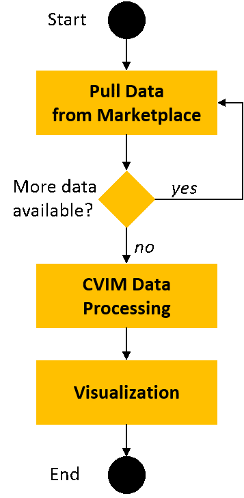
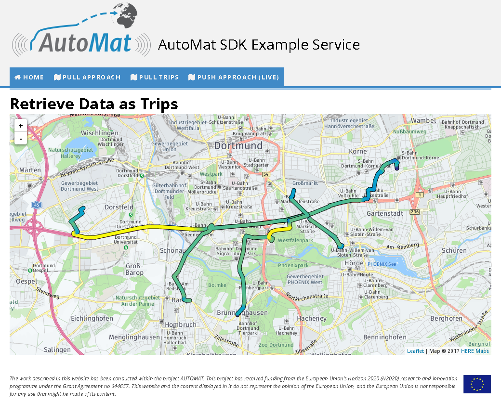

# AutoMat Software Development Kit (SDK) Example Service
The SDK example service shall serve as an example for Service Providers for the integration into their own backends. The service is open and freely available. As an example, the service retrieves position and velocity from vehicles via the Marketplace and display the trajectories on a map. Hereby, the service implements the following basic functionalities:
- **Data retrieval using pull approach**: Data requests based on the Marketplace’s pull data retriev-al. Hereby, an active request is sent to the Marketplace, where all data is returned.
- **Trip retrieval using pull approach**: Trips are requested from the Marketplace. Afterwards data from each trip is pulled separately. The pre-configured data-offer includes Position as well as Speed data. Both data are combined and aligned in terms of time-series interpolation. After-wards data is visualized using a coloured trajectory. The redder the trajectory line, the faster the vehicle.
- **Live data retrieval using push approach**: The SDK Example Services leverages the AEON Fi-ware SDK in order to allow live data retrieval. Hereby, the service establishes a socket connec-tion to the Marketplace. When new data arrives, it is immediately received and available for pro-cessing. 
- **Processing**: Combines, processes and filtering of CVIM Data Packages. Vehicle speed and po-sition packages are combined. When necessary, additional filters (e.g. only vehicle speed great-er than 100 km/h) are applied. 
- **Evaluation**: The results of the processing are displayed in form of coloured vehicle trajectories, where the colour indicates the vehicle speed.
The source code of the example service is available via the following link:
```
https://github.com/automat-project/example-service
```

##	Requirements and Dependencies
The example service is written in the programming language `Python` and makes use of the following free open-source software components:

**Backend**
- Python, Version 3 or later, Programming language used for the service
- Python-Flask, Version 0.12, micro web development framework for python
- Python-Requests, Version 2.13.0, HTTP request library
- Python-dateutil, Version 2.6.0, Python date-time converter
- NumPy, Version 1.9.2, Python scientific computation library Frontend (included in the service’s source code)
- Leaflet, version 1.0.0-rc.1, JavaScript Visualization of routes on a map
- Leaflet-hotline, version 0.3.0, Leaflet plugin for colouring of trajectories
- AEON SDK, Version 0.3.0, Broker plugin supporting FIRWARE. 

**Leveraged services**
- Font Awesome, version 4.7.0, icons for the frontend
- Open Street Map, Crowdsource maps
- Here Maps API, High quality maps 

##	Installation
The following steps need to be performed in order to run the service:
1. Install and satisfy requirements and dependencies
   1. Install Python
   1. Install Python plugins
2. Download / Retrieve service source code
3. Start service

### Python Installation
The service is written in the programming language Python. Therefore, a Python environment is required in order to run the service. 
On a `Microsoft Windows` operating system it is recommended to use the open and free [`Anaconda` runtime](https://www.continuum.io/downloads). Anaconda consists of the actual Python interpreter in addition with over 720 packages that provide open data science platform in an isolated environment. It can be easily installed using the downloadable installer.
For `Linux` or `Mac OS` operating system, it is recommended to use the system’s package manager to install python. e.g. for the Debian or Ubuntu Linux distributions the following command will install python:
```
# apt-get install python3 python3-pip
```

#### Python Plugin Installation
All python plugins (Flask and dateutil) can be installed using the python packaging tool pip via the command line:
```
pip install Flask
pip install requests
pip install numpy
```

#### Download Service Source Code
The service can be downloaded using the source code versioning control system git . 
```
git clone https://github.com/automat-project/example-service.git
```

Alternatively, all files can be downloaded as one zip file under the following link:
```
https://raw.githubusercontent.com/automat-project/example-service/master/dist/Automat_SDK_Example_Service-2.0.1.zip
```

To verify, that all dependencies and the source code have been installed correctly, you can switch into the example-service directory and run the setup.py as follows:
```
cd example-service
python setup.py build
```

The following figure hows the build process. When no error message is displayed, the service is ready to be used.


##	Structure and Files
The source code is structured as following:
```
├── AutoMatExampleService          – source code of the service
│   ├── static                     – static files, e.g. leaflet plugins, stylesheets
│   │   └── ...
│   ├── templates                  – templates of the frontend layout
│   │   └── ...
│   └── service.py                 – The example service
├── build                          – output of setup process
├── dist                           – release files
│   └── Example Service-2.0.zip    – All source code files of the service in one zip archive
├── doc                            – Files used for documentation of the service
│   └── ...
├── MANIFEST.in                    – Configuration of setup utility
├── README.md                      – General information about the service (this file)
├── setup.cfg                      – Configuration of setup utility
└── setup.py	                   – Setup utility
```

##	Usage
This section describes the usage of the example service. 

###	Start Service
In order to use and run the service, it has to be started first. Hereby, the command line has to be used. Switch into the source code directory and then into the  AutoMatExampleService directory. After-wards, the service can be started by using python to invoke `service.py`. The figure below shows the startup of the service. 

```
cd example-service/AutoMatExampleService
python service.py
```


###	Open landing page
After the service has been started, it can be accessed with a standard internet browser via the URL:
```
http://localhost:5000
```` 

The next screenshot shows the landing page of the SDK Example service opened in a Mozilla Firefox web browser. 
 


### Pull data retrieval
The pull data retrieval is the most trivial way of retrieving data from the Marketplace. Hereby, a `HTTP GET` request is performed to the Marketplace REST API and data is returned. The figure below shows the flow diagram of the example service. First, the data is pulled from the Marketplace. An minimum amount of data can be specified. If there is not enough data available, more can be retrieved. Afterwards the application evaluates the CVIM data. In case of the example service, the position’s latitude and longitude is extract-ed. Afterwards the Leaflet Javascript tool is used to visualize the trajectories. 
 


The screenshot below shows the example service. The visualization uses the HERE maps API in combination with the leaflet plugin to visualize different vehicle trajectories. Here, data from simulated vehicles is displayed in the are of the city Dortmund.


### Trip data retrieval
The trip data retrieval is more advanced than the simple pull data retrieval. Here, data from two (or more) different sensors can be retrieved from the same vehicle. A trip designates a certain amount of time during, where the vehicle was collecting data. All data, which is aggregated during this time is summarized in one trip.
Within the scope of the example service trips from different vehicles are pulled from the Marketplace. The according offer includes position and speed data. The data of one trip is processed and visualized as a colored trajectory. The redder the trajectory, the faster is the vehicle. 
Below screenshot shows the flow diagram of the pull data retrieval using trips. First all trip information are retrieved from the Marketplace. Afterwards, for each trip, the CVIM data packages need to be pulled. As part of the follow-up CVIM data processing, speed and position information are combined. As the starting- and stopping times do not always match and timestamps of each time series may vary a time-series-interpolation  is performed. Afterwards, the data is pre-processed for the visualization by combin-ing positions with the interpolated speed data. In the last step, the data is visualized. 


The next screnshot shows of the trip-data retrieval. The plot uses simulated vehicle data from the area of Dortmund. Especially on its central road B1 on its eastern part the allowed vehicle speed is high-er (~100 km/h) , resulting in a yellow color. Inside the city, vehicle speed is between 30 and 50 km/h (green color). In Below 30 km/h the color is more blueish. 
 


### Push data retrieval
In order to retrieve low latency data, a push data retrieval has been implemented in the Marketplace, leveraging and reusing existing Fiware functionalities. Therefore, the SDK Example Service is based on the [AEON Javascript SDK](https://github.com/atos-ari-aeon/fiware-cloud-messaging-sdk). 
The push data example established a socket connection to the Marketplace and registers his offer of the established connection. Whenever new data arrives for the according offer, it is immediately forwarded (“pushed”) by from marketplace to the service. As part of the SDK, simulated data is pushed into this offer once per second. A video of the live data retrieval can be found at 
```
https://www.youtube.com/watch?v=PddfoL3qToM
```
[](http://www.youtube.com/watch?v=PddfoL3qToM "AutoMat SDK Example Service")


The figure below shows the flow diagram of the push data retrieval. In the first step, a socket connection to the Marketplace is established using the AEON SDK. Afterwards, new pushes are awaited. Whenever new data arrives, the CVIM data is processed similarly as described in the previous section. Afterwards the trajectories of the vehicles are displayed. 


The next figure shows a screenshot of the example service. On the upper half a map displays all trajectories of received CVIM data. In the lower half, a log acknowledges the reception of data packages. 

 data retrieval of the example service")


